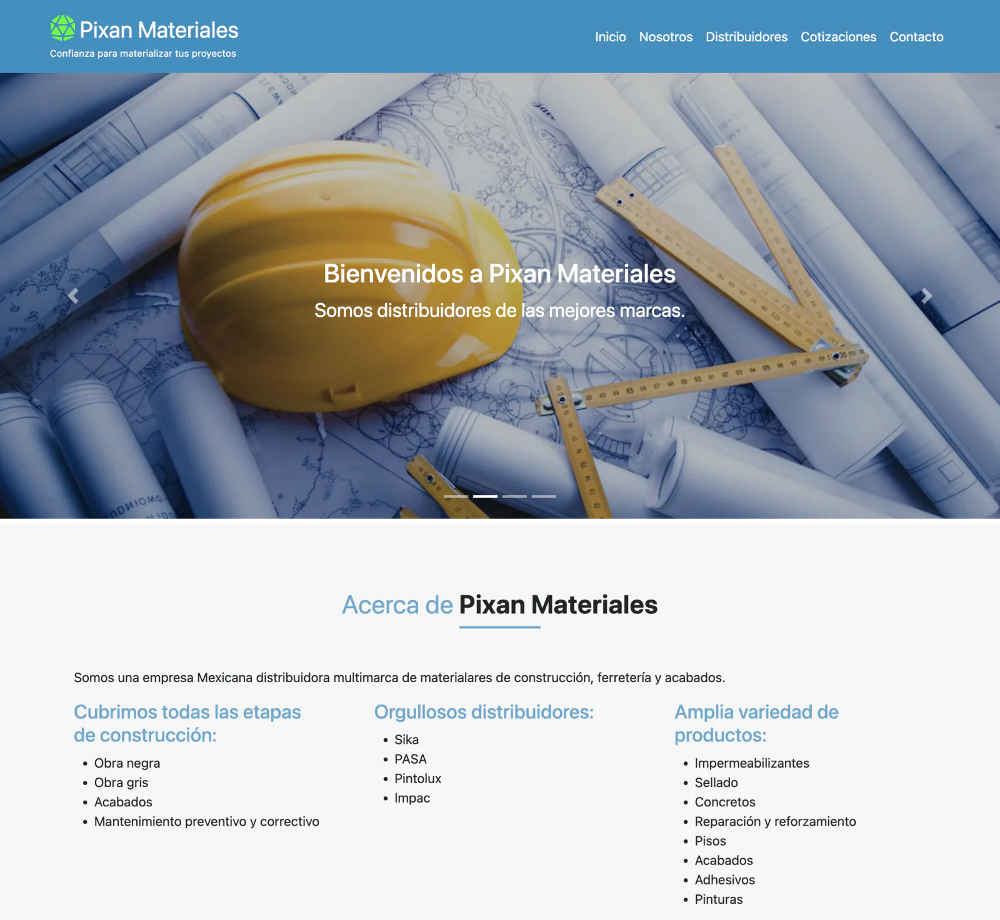

# 👷🏻 Pixan Materiales 🏗️

### Official landing site for a construction materials distributor, built to be fast, clear, and easy to deploy.

Pixan Materiales is a responsive one-page website focused on presenting services, distributor brands, payment options, and contact channels in a clean format. The project is currently a static frontend.

---

## ✨ Features

| | Feature | What It Does |
|---|---|---|
| 🧭 | One-page navigation | Smooth scrolling between key sections (Inicio, Nosotros, Servicios, Distribuidores, Cotizaciones, Contacto). |
| 🛠️ | Service showcase | Visual cards explain Pixan's core services with image overlays and short descriptions. |
| 🤝 | Distributor catalog | Flip cards present partner brands and their product lines in a compact format. |
| 📨 | Contact + quote UI | Includes quote and contact form layouts ready to connect to a backend later. |
| 📱 | Responsive layout | Bootstrap-based layout works across mobile and desktop screen sizes. |

---

<p align="center">
  
</p>

---

## 🛠️ Tech Stack


---

## 🧩 Project Snapshot

- Static frontend project (no `server/` yet; forms are UI-ready and pending backend/email integration).
- Main app lives in `client/` with `index.html`, `assets/css/`, `assets/js/`, and optimized image assets.

---

## 🚀 Live Demo


[](https://github.com/jorguzman100/pixan-materiales)

No public deployment yet. Run it locally for now.

---

## 💻 Run it locally

```bash
git clone https://github.com/jorguzman100/pixan-materiales.git
cd pixan-materiales
python3 -m http.server 8000 --directory client
```

### 🔗 Local URL

- Frontend: `http://localhost:8000`

### 🔐 Environment variables

- No `.env` file is required for the current version (static frontend only).

---

## 🤝 Contributors

- **Jorge Guzman**  ·  [@jorguzman100](https://github.com/jorguzman100)
